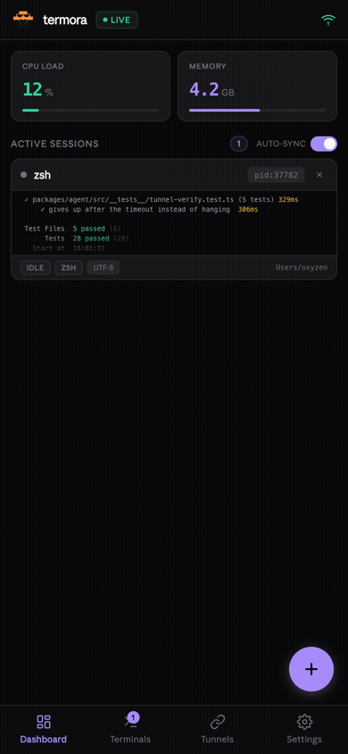
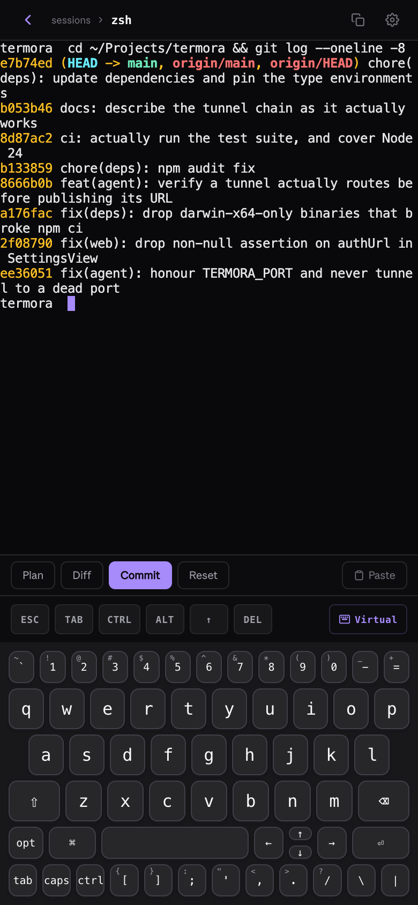
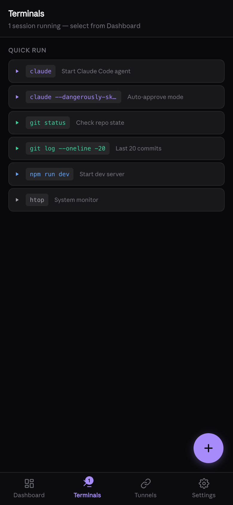
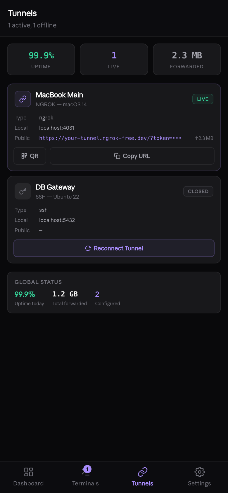
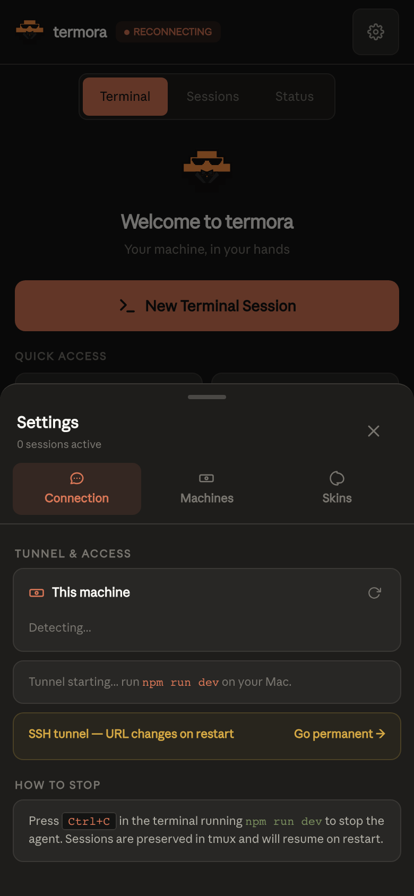
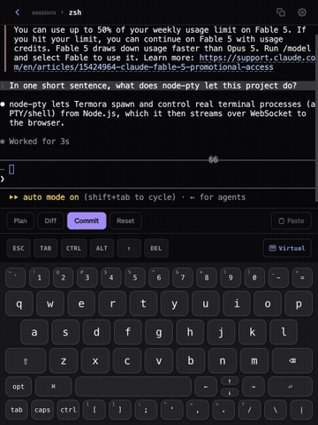
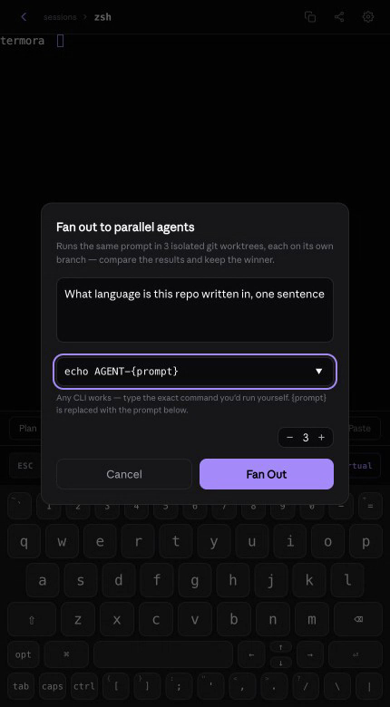

<div align="center">


<br /><br />

[](https://github.com/royaluniondesign-sys/termora/releases/latest)
[](https://github.com/royaluniondesign-sys/termora/actions/workflows/ci.yml)
[](https://typescriptlang.org)
[](https://nodejs.org)
[](LICENSE)
[]()
[](#security)
[](CONTRIBUTING.md)

**Real terminal access from your phone. Not SSH. Not a simulation. A real PTY on your machine, streamed to your pocket.**

[Quickstart](#quickstart) · [How it works](#how-it-works) · [Fan out to parallel agents](#fan-out-to-parallel-agents) · [vs. Termux](#termora-vs-termux) · [Security](#security) · [Multi-machine](#multi-machine) · [Contributing](CONTRIBUTING.md)

</div>

---

<div align="center">

<br /><sub>Real capture — dashboard, an active session, tunnel status, and settings</sub>
<br /><br />
<table>
<tr>
<td align="center"><br /><sub><b>Real PTY session</b></sub></td>
<td align="center"><br /><sub><b>Session dashboard</b></sub></td>
<td align="center"><br /><sub><b>Tunnel status</b></sub></td>
<td align="center"><br /><sub><b>Connection panel</b></sub></td>
</tr>
</table>
</div>

---

## Quickstart

New to running things from a terminal? This section assumes nothing —
follow it top to bottom and you'll have termora on your phone in about
two minutes.

### 1. Install the one thing you need

termora needs [Node.js](https://nodejs.org) version 20 or newer, on a Mac or
Linux machine (the machine you want to control from your phone — not the
phone itself).

Check if you already have it:

```bash
node --version
```

If that prints `v20.x.x` or higher, skip to step 2. Otherwise, install
Node.js from [nodejs.org](https://nodejs.org) (the "LTS" button is the one
you want), or with a package manager:

```bash
brew install node          # macOS, via Homebrew
```

### 2. Get termora and start it

Open a terminal on your Mac/Linux machine and run:

```bash
git clone https://github.com/royaluniondesign-sys/termora.git
cd termora
npm install
npm run dev
```

`npm install` downloads termora's dependencies — it can take a minute the
first time. `npm run dev` then starts the agent.

### 3. Scan the QR code

A QR code appears right there in your terminal. Open your phone's camera
app, point it at the QR code, and tap the notification that pops up.

That's it — you're looking at a real terminal on your computer, from your
phone. No account, no signup, no app to install on the phone (it's a normal
web page).

> **Didn't get a QR code, or it won't scan?** Copy the URL printed below it
> instead and open it directly in your phone's browser.

### Next time

Once it's cloned, starting it again is just:

```bash
cd termora && npm run dev
```

**To stop it:** press `Ctrl+C` in the terminal where `npm run dev` is
running. Your shell sessions keep their scrollback (via tmux) and pick up
right where you left off next time you start it.

---

## How It Works

```
  Your Phone / Tablet / Browser
        |
        | HTTPS + WebSocket (encrypted)
        v
  +---------------------------+
  |  Tunnel (auto-selected)   |
  |  1. cloudflared           |  ← no signup, no bandwidth cap
  |  2. ngrok (static URL)    |
  |  3. localhost.run (SSH)   |
  |  4. Wi-Fi (LAN fallback)  |
  +----------+----------------+
             v
  +---------------------------+
  |   termora agent           |  ← runs on your machine
  |   PTY 0: zsh              |
  |   PTY 1: claude code      |
  |   PTY 2: vim / htop...    |
  |   up to 8 live sessions   |
  +---------------------------+
```

1. `npm run dev` starts the backend agent + React frontend
2. The agent spawns real terminal sessions via `node-pty`
3. A tunnel (auto-selected) exposes the agent over HTTPS
4. A one-time bootstrap token + QR code authenticates your phone
5. xterm.js renders terminals with full color, WebGL acceleration, and interactivity
6. When tmux is installed, sessions survive server restarts with full scrollback

---

## Why termora

### Security

termora is hardened at every layer:

| Layer | Protection |
|-------|-----------|
| **Authentication** | One-time bootstrap token (5-min TTL) + 7-day JWT rotation |
| **Per-device sessions** | Every device that signs in gets its own revocable session — see and sign out any one of them from Settings, independently, without logging out the rest |
| **Static token** | Persistent auth URL — share once, always works; embedded in QR |
| **Rate limiting** | Auth endpoints: 10 req/15min per IP (proxy headers trusted only from loopback) |
| **Transport** | All traffic over HTTPS via the active tunnel |
| **Token comparison** | Constant-time to prevent timing attacks |
| **Input validation** | Resize bounds (1–500 cols/rows), stdin capped at 1MB |
| **Backpressure** | WebSocket buffer limit at 64KB — prevents OOM under load |
| **CORS** | No cross-origin access at all — the app is always same-origin, so nothing needs it |
| **No cloud storage** | Your data never leaves your machine |

No accounts. No relay servers. No third-party access to your terminal.

### Portability

Your terminal goes with you — across devices, across networks, across countries.

- **4-tier tunnel fallback** — cloudflared → ngrok → SSH (localhost.run) → Wi-Fi. Works instantly without any signup.
- **Static URL with ngrok** — same URL every session. Bookmark it. Add it to your phone's home screen as a PWA.
- **One-click auth URL** — token embedded in URL. Share the link, scan once, never re-authenticate.
- **Zero-config start** — `npm run dev` is all you need.
- **Auto-recovery** — every tunnel URL is health-checked before it is published, and falls through to the next method if it does not route. Reconnects after sleep/wake or network change.
- **PWA install** — add to home screen, runs fullscreen, no browser chrome.

### Performance & Fluidity

termora is built to feel native, not laggy:

- **WebGL rendering** — xterm.js WebGL renderer for hardware-accelerated terminal output
- **Zero-loss reconnection** — when you reconnect after a drop, the full session buffer replays automatically with progress feedback
- **Session persistence** — tmux control mode wraps sessions; they survive server restarts with full scrollback history
- **Backpressure management** — WebSocket buffer threshold prevents memory spikes under heavy output
- **Sub-50ms latency** on local Wi-Fi; performant over HTTPS tunnels

### Any CLI Agent, Not Just One

<div align="center">

<br /><sub>Real capture — Claude Code running on the host machine, asked a question from termora</sub>
</div>

termora was built with Claude Code in mind, but it isn't built *for* Claude
Code — it's a real terminal, so it runs whatever you'd run by hand: Claude
Code, OpenCode, Codex, Cline, aider, Hermes, Antigravity, gemini-cli,
goose, or anything else that lives in a shell. termora has no idea which
one you're running; it just streams the PTY.

- Watch any CLI agent work in real time from your phone, full color ANSI
  rendering — diffs, spinners, progress bars all work
- Custom keyboard with `Ctrl`, `Tab`, `Esc`, arrow keys, and configurable
  shortcuts (commit, diff, plan, Ctrl+C) built in
- Sticky modifiers — tap Shift/Ctrl/Opt once, it stays for the next key
- Touch Actions Bar — select, copy, paste, cut without fighting the mobile
  keyboard
- Session grid — see all your terminals at a glance; switch instantly

### Fan Out to Parallel Agents

<div align="center">

<br /><sub>Real capture — command template filled in, ready to fan out across 3 worktrees</sub>
</div>

One prompt, run across several agents at once — each in its own **git
worktree**, on its own branch, so they can't step on each other's files or
git state. Compare the results side by side in the normal Terminals list
(no separate view needed) and keep the winner.

termora has no built-in notion of any agent's CLI flags — different tools
take a prompt differently (`claude -p`, `opencode run`, `aider --message`,
some just take it as a bare trailing argument) — so the command field is a
literal template with a `{prompt}` placeholder, run exactly as typed:

```
claude -p {prompt}
opencode run {prompt}
codex exec {prompt}
aider --message {prompt}
```

No placeholder at all also works — the prompt is appended as a final
argument.

---

## Features

### Terminal
- **Multiple live sessions** — up to 8 concurrent PTYs, create/rename/close
- **Real PTY** — full zsh/bash with colors, vim, htop, tmux, everything works
- **Session persistence** — sessions survive server restarts via tmux (auto-detected, no config)
- **Fan out to parallel agents** — one prompt, N agents, each in its own isolated git worktree — [see above](#fan-out-to-parallel-agents)
- **Session grid** — 2-column card layout with live terminal previews

### Touch & Mobile
- **Touch Actions Bar** — select, copy, paste, cut, tab, history — always visible
- **Zero-loss reconnection** — buffer replay on reconnect with progress indicator
- **PWA** — install to home screen, runs fullscreen, no browser chrome
- **iOS system keyboard suppressed** — custom keyboard takes over

### Keyboard
- **Two layouts** — iOS Terminal (6-row) and MacBook (5-row)
- **Sticky modifiers** — Shift/Ctrl/Opt/Cmd stay active for next key
- **Key repeat** — hold any key for auto-repeat (400ms delay, 60ms interval)
- **Context strip** — quick-access: Esc, F1–F5, commit, diff, plan, Ctrl+C
- **6 skins** — iOS Terminal, MacBook Silver, Gamer RGB, Custom Painted, Amber Retro, Ice White

### Connectivity
- **4-tier tunnel fallback** — cloudflared → ngrok → SSH (localhost.run) → local Wi-Fi
- **Verified before published** — a tunnel that reports a URL it does not actually route is discarded automatically
- **Zero-config start** — works immediately; cloudflared and SSH need no signup
- **Static URL with ngrok** — same URL every time, bookmarkable for PWA
- **Auto-recovery** — tunnel recreates after sleep/wake
- **One-click auth URL** — token embedded in URL, share with any device
- **Connection panel** — shows live tunnel mode, copyable auth URL, ngrok setup, stop instructions

---

## termora vs. Termux

They get compared because both put a terminal on your phone. They solve
different problems.

**[Termux](https://termux.dev)** is a Linux environment that runs *inside*
Android. It gives you a real shell, a package manager, and Python/Node/etc —
but it's a sandbox on the phone itself. Your actual project, your actual
running dev server, your actual `git` history — none of that is there. You'd
be starting a second, separate environment from scratch, and it's
Android-only: no iPhone, no iPad, no tablet from another vendor.

**termora** doesn't put a Linux environment on your phone. It puts your
phone in front of the Linux environment you already have — your Mac, your
Ubuntu box, your build server, wherever your code and your tools actually
live. The phone is just the screen and keyboard; the terminal, the shell
history, the tmux sessions, `claude`/`opencode`/whatever you run — all of it
is the real thing, running on the real machine, exactly as if you'd walked
up to it.

| | Termux | termora |
|---|---|---|
| **What it is** | A Linux distro running inside Android | A window onto a terminal on your actual computer |
| **Where your code lives** | Wherever you clone it *inside Termux* — separate from your desktop | Wherever it already is, on the machine you're actually developing on |
| **Platform** | Android only | Any device with a browser — iPhone, iPad, Android, another laptop |
| **Setup per project** | Reinstall your toolchain (Node, Python, git config...) inside Termux | None — it's the same machine, same environment, already set up |
| **Access from outside your Wi-Fi** | Needs your own SSH/VPN setup | Built in — cloudflared/ngrok/SSH tunnel, auto-selected, no config |
| **UI** | Text-only terminal emulator | Touch-tuned terminal + dashboard, tap-to-run commands, session grid |
| **Session persistence** | Survives app restarts (it's a local process) | Survives agent *and device* restarts, via tmux control mode |
| **Keyboard** | Phone keyboard + Termux's key row | Configurable virtual keyboard with modifier stickiness, skins, per-key colors |

If what you want is a Linux box that happens to run on your Android phone,
Termux is the right tool. If what you want is your laptop or server's actual
terminal, in your pocket, termora is what that is for.

---

## Multi-Machine

Run termora on multiple machines. Access all of them from your phone.

**On each machine:**

```bash
git clone https://github.com/royaluniondesign-sys/termora.git
cd termora && npm install && npm run dev
```

Each instance generates its own QR code and auth URL. Bookmark each URL in your phone's browser or add each as a separate PWA — you'll have a separate icon per machine.

**With ngrok static domains** (optional):

```bash
# Machine A
NGROK_STATIC_DOMAIN=macbook.ngrok-free.dev npm run dev

# Machine B
NGROK_STATIC_DOMAIN=server.ngrok-free.dev npm run dev
```

Same URL every time per machine. No re-scanning after restarts.

---

## Session Persistence

When tmux is installed, termora automatically wraps sessions in tmux control mode. Sessions survive server restarts with full scrollback history.

```bash
brew install tmux    # macOS
sudo apt install tmux  # Ubuntu/Debian
```

No configuration needed. termora auto-detects tmux and enables persistence.

---

## Configuration

Create a `.env` file in the project root (all optional):

```bash
NGROK_AUTHTOKEN=your_token            # Get free at ngrok.com
NGROK_STATIC_DOMAIN=your.ngrok-free.dev  # Free static domain from ngrok dashboard
TERMORA_PORT=4030                     # Default: 4030
TERMORA_NO_TMUX=1                     # Disable tmux integration
TERMORA_NO_OPEN=1                     # Don't auto-open browser
TUNNEL=cloudflared                    # Force a method: cloudflared | ngrok | ssh | local
```

`WEB_PORT` exists for development only — `npm run dev` sets it so the tunnel
reaches the Vite dev server instead of the agent. Leave it unset in production;
the agent serves the built UI itself.

```bash
```

**Install cloudflared** (optional, first tunnel choice — no account needed):
```bash
brew install cloudflared
```
Note: cloudflared's free quick tunnels (`*.trycloudflare.com`) are occasionally
unroutable from some networks — the edge answers 404 while the connector reports
success. termora detects this and moves on to the next method automatically.

**Get a free ngrok static URL:**
```bash
brew install ngrok
ngrok config add-authtoken YOUR_TOKEN
# Then add NGROK_AUTHTOKEN + NGROK_STATIC_DOMAIN to .env
```

---

## Tech Stack

| Layer | Technology |
|-------|-----------|
| Frontend | React 18, TypeScript, Vite 6, Tailwind CSS v4, xterm.js (WebGL) |
| Backend | Node.js 20+, Express, ws, node-pty, tmux (control mode), better-sqlite3 |
| Tunnel | cloudflared, @ngrok/ngrok SDK, localhost.run (SSH fallback) |
| Auth | jose (JWT), one-time bootstrap tokens, express-rate-limit |
| Testing | Vitest (28 tests passing) |
| Monorepo | Turborepo, npm workspaces |

## Project Structure

```
termora/
├── packages/
│   ├── agent/     # Backend: Express + WebSocket + node-pty + auth + tunnel
│   ├── web/       # Frontend: React + xterm.js + Tailwind + keyboard system
│   └── cli/       # CLI wrapper (future)
└── assets/        # Logo and banner
```

---

## Security Policy

Found a vulnerability? See [SECURITY.md](SECURITY.md) for our responsible disclosure policy.

## Contributing

Contributions welcome. See [CONTRIBUTING.md](CONTRIBUTING.md) for development setup and guidelines.

## Support the Project

termora is open source and free.

- Star this repo
- [Sponsor on GitHub](https://github.com/sponsors/royaluniondesign-sys)
- See [SPONSORS.md](SPONSORS.md) for more ways to help

## License

MIT — see [LICENSE](LICENSE) for details.

---

<div align="center">

Made by **[RUD](https://github.com/royaluniondesign-sys)** · Star if termora is useful to you

</div>
