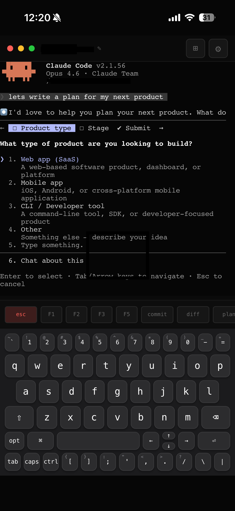
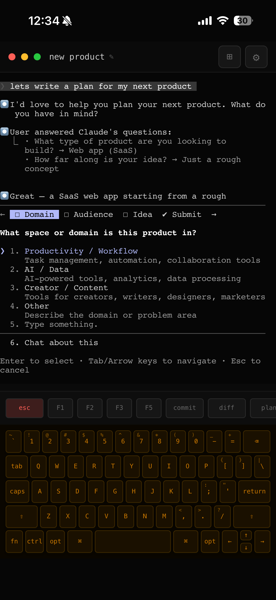
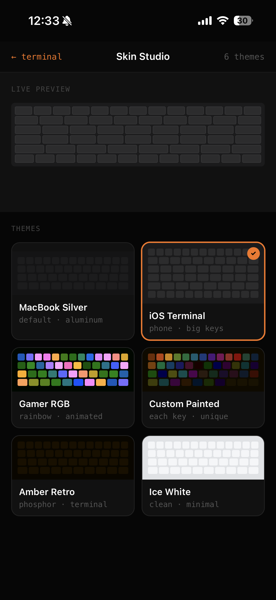

<div align="center">


# termora

**Your machine, in your hands.**

Real terminal access from your phone. Not SSH. Not a simulation.
A real PTY on your machine, streamed to your pocket.

[](https://typescriptlang.org)
[](LICENSE)
[](CONTRIBUTING.md)
[](https://nodejs.org)
[]()
[]()
[]()
[]()

<br />

[Getting Started](#quickstart) · [Features](#features) · [Security](#security) · [Contributing](CONTRIBUTING.md) · [Sponsor](SPONSORS.md)

</div>

---

<div align="center">

</div>

<div align="center">
<table>
<tr>
<td align="center"><br /><sub><b>Session Grid</b></sub></td>
<td align="center"><br /><sub><b>Claude Code on Phone</b></sub></td>
<td align="center"><br /><sub><b>Live Terminal</b></sub></td>
</tr>
<tr>
<td align="center"><br /><sub><b>MacBook Keyboard Skin</b></sub></td>
<td align="center"><br /><sub><b>Skin Studio — 6 Themes</b></sub></td>
<td></td>
</tr>
</table>
</div>

---

## What is termora?

termora gives you real terminal access to your Mac from your phone. Clone, install, run — scan the QR code and you're in. Multiple live terminal sessions, a custom keyboard built for terminal use, 6 keyboard skins, touch-optimized copy/paste, and zero-loss reconnection. Open source, zero config.

**Key highlights:**

- Run Claude Code from your phone and watch it work in real time
- **Touch Actions Bar** — select, copy, paste directly on the terminal
- Multiple terminal sessions with live grid preview
- Custom keyboard with sticky modifiers, key repeat, and context strip
- 3-tier tunnel: ngrok, SSH, Wi-Fi (works without any signup)
- **Zero-loss reconnection** — close the app, reopen, everything's still there
- Install as a PWA — fullscreen, no browser chrome

## Quickstart

> **Requires [Node.js 20+](https://nodejs.org)** and macOS or Linux.

```bash
git clone https://github.com/royaluniondesign-sys/termora.git
cd termora
npm install
npm run dev
```

A QR code prints to the console. Scan it on your phone. That's it.

## How It Works

```
  Phone / Tablet / Browser
        |
        | HTTPS (WebSocket)
        v
  +----------------+
  |  Tunnel        |  ngrok / SSH (localhost.run) / Wi-Fi
  +-------+--------+
          v
  +------------------------+
  |  termora agent         |  <- runs on your machine
  |  +-- PTY 0: zsh        |
  |  +-- PTY 1: claude     |
  |  +-- PTY 2: ...        |
  |  +-- up to 8 sessions  |
  +------------------------+
```

1. `npm run dev` starts the backend agent + React frontend
2. The agent spawns real terminal sessions via `node-pty`
3. When tmux is installed, sessions are wrapped in tmux for **persistence** — they survive server restarts
4. A tunnel (ngrok, SSH, or Wi-Fi) exposes the agent over HTTPS
5. A one-time bootstrap token + QR code authenticates your phone
6. xterm.js renders the terminals in your browser with full color and interactivity

## Security

termora is designed with security as a core principle, not an afterthought.

| Feature | Detail |
|---------|--------|
| **JWT Authentication** | 7-day rotation with one-time bootstrap tokens |
| **Rate Limiting** | Auth endpoints protected (10 req/15min per IP) |
| **Encrypted Tunnels** | All traffic over HTTPS via ngrok or SSH |
| **No Cloud Storage** | Your data never leaves your machine |
| **Restrictive CORS** | Production-mode restricts origins |
| **Constant-time Comparison** | Token verification prevents timing attacks |
| **Input Validation** | Resize bounds (1-500), stdin max 1MB |
| **Backpressure** | WebSocket buffer limit prevents OOM (64KB threshold) |

Found a vulnerability? See [SECURITY.md](SECURITY.md) for our disclosure policy.

## Features

### Terminal
- **Multiple live sessions** — create, rename, close; up to 8 concurrent PTYs
- **Real PTY** — full zsh/bash with colors, vim, tmux, everything
- **Session persistence** — sessions survive server restarts via tmux (async, non-blocking)
- **Session grid** — 2-column card layout with live terminal previews

### Touch and Mobile
- **Touch Actions Bar** — select, copy, paste, cut, tab, history — always visible
- **Zero-loss reconnection** — automatic buffer replay on reconnect with progress feedback
- **PWA** — install to home screen, runs fullscreen
- **iOS keyboard suppressed** — custom keyboard replaces system keyboard

### Keyboard
- **Two layouts** — iOS Terminal (6-row) and MacBook (5-row)
- **Sticky modifiers** — tap Shift/Ctrl/Opt/Cmd once, it stays for the next key
- **Key repeat** — hold any key for auto-repeat (400ms delay, 60ms interval)
- **Context strip** — quick-access: esc, F1-F5, commit, diff, plan, Ctrl+C
- **6 skins** — iOS Terminal, MacBook Silver, Gamer RGB, Custom Painted, Amber Retro, Ice White

### Connectivity & Multi-Machine
- **3-tier tunnel fallback** — ngrok, localhost.run SSH, local Wi-Fi
- **Zero-config start** — works immediately with SSH tunnel (no signup needed)
- **Static URL with ngrok** — same URL every time for PWA home screen
- **Auto-recovery** — tunnel recreates after sleep/wake
- **One-click auth URL** — token embedded in URL; share with any device, no re-scanning
- **Multi-machine** — each Mac runs its own agent; bookmark multiple URLs for different machines
- **Connection panel** — shows live tunnel mode, copyable auth URL, ngrok setup guide, stop instructions

## Tech Stack

| Layer | Technology |
|-------|------------|
| Frontend | React 18, TypeScript, Vite 6, Tailwind CSS v4, xterm.js (WebGL) |
| Backend | Node.js 20+, Express, ws, node-pty, tmux (control mode), better-sqlite3 |
| Tunnel | @ngrok/ngrok SDK, localhost.run (SSH fallback) |
| Auth | jose (JWT), one-time bootstrap tokens, express-rate-limit |
| Testing | Vitest (14 tests passing) |
| Monorepo | Turborepo, npm workspaces |

## Project Structure

```
termora/
+-- packages/
|   +-- agent/     # Backend: Express + WebSocket + node-pty + auth + tunnel
|   +-- web/       # Frontend: React + xterm.js + Tailwind + keyboard system
|   +-- cli/       # CLI wrapper (future)
+-- assets/        # Logo and media
+-- docs/images/   # Screenshots
```

## Configuration

Create a `.env` file in the project root (optional):

```bash
NGROK_AUTHTOKEN=your_token
NGROK_STATIC_DOMAIN=your-subdomain.ngrok-free.dev
TERMORA_PORT=4030
TERMORA_NO_TMUX=1
TERMORA_NO_OPEN=1
TUNNEL=ssh
```

## Session Persistence

When tmux is installed, termora automatically wraps sessions in tmux using **control mode** (`-CC`). Sessions survive server restarts with full scrollback history.

```bash
brew install tmux    # macOS
sudo apt install tmux  # Ubuntu/Debian
```

No configuration needed. termora auto-detects tmux and enables persistence.

## Contributing

We welcome contributions! See [CONTRIBUTING.md](CONTRIBUTING.md) for development setup and guidelines.

## Support the Project

termora is open source and free. If it's useful to you:

- Star this repo
- [Sponsor on GitHub](https://github.com/sponsors/royaluniondesign-sys)
- See [SPONSORS.md](SPONSORS.md) for more ways to help

## License

MIT — see [LICENSE](LICENSE) for details.

---

<div align="center">


Made by **[RUD](https://github.com/royaluniondesign-sys)** · Star this repo if termora is useful to you

</div>
