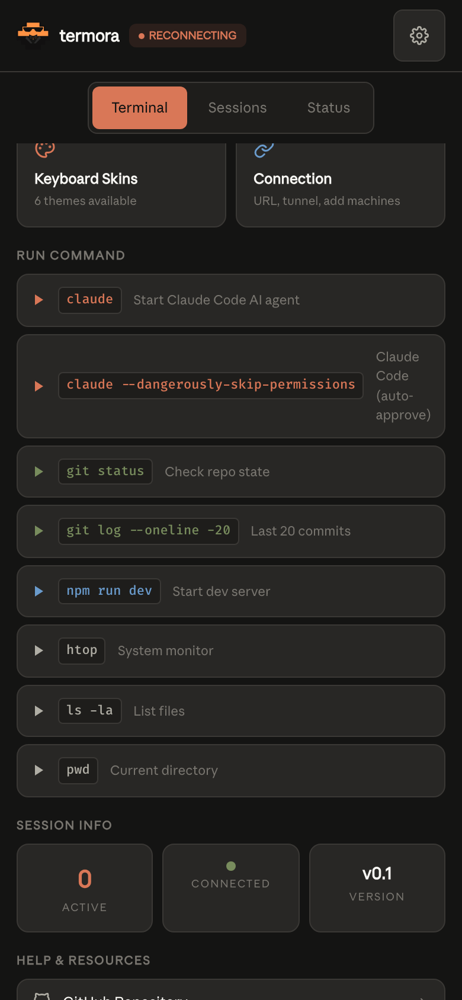
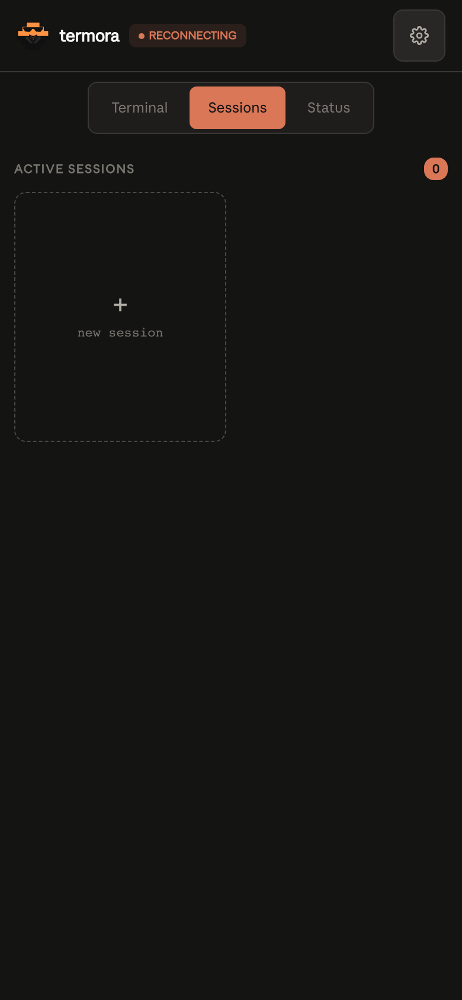
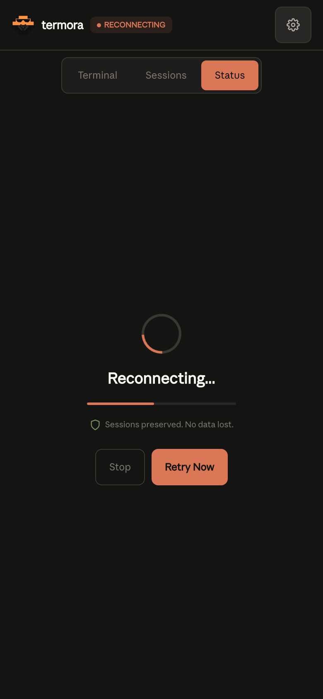

<div align="center">


<br /><br />

[](https://typescriptlang.org)
[](https://nodejs.org)
[](LICENSE)
[]()
[]()
[](CONTRIBUTING.md)

**Real terminal access from your phone. Not SSH. Not a simulation. A real PTY on your machine, streamed to your pocket.**

[Quickstart](#quickstart) · [How it works](#how-it-works) · [Security](#security) · [Multi-machine](#multi-machine) · [Contributing](CONTRIBUTING.md)

</div>

---

<div align="center">
<table>
<tr>
<td align="center"><br /><sub><b>Terminal & Quick Launch</b></sub></td>
<td align="center"><br /><sub><b>Tap-to-Run Commands</b></sub></td>
<td align="center"><br /><sub><b>Session Grid</b></sub></td>
</tr>
<tr>
<td align="center"><br /><sub><b>Connection Status</b></sub></td>
<td align="center"><br /><sub><b>Connection Panel</b></sub></td>
<td></td>
</tr>
</table>
</div>

---

## Quickstart

> Requires [Node.js 20+](https://nodejs.org) and macOS or Linux.

```bash
git clone https://github.com/royaluniondesign-sys/termora.git
cd termora
npm install
npm run dev
```

A QR code appears in the console. Scan it with your phone. You're in — full terminal, real PTY, no signup required.

**Already installed?**

```bash
cd termora && npm run dev
```

**Stop it:**

```bash
# Press Ctrl+C in the terminal where npm run dev is running
```

---

## How It Works

```
  Your Phone / Tablet / Browser
        |
        | HTTPS + WebSocket (encrypted)
        v
  +---------------------------+
  |  Tunnel (auto-selected)   |
  |  1. ngrok (static URL)    |
  |  2. localhost.run (SSH)   |  ← works instantly, no signup
  |  3. Wi-Fi (LAN fallback)  |
  +----------+----------------+
             v
  +---------------------------+
  |   termora agent           |  ← runs on your machine
  |   PTY 0: zsh              |
  |   PTY 1: claude code      |
  |   PTY 2: vim / htop...    |
  |   up to 8 live sessions   |
  +---------------------------+
```

1. `npm run dev` starts the backend agent + React frontend
2. The agent spawns real terminal sessions via `node-pty`
3. A tunnel (auto-selected) exposes the agent over HTTPS
4. A one-time bootstrap token + QR code authenticates your phone
5. xterm.js renders terminals with full color, WebGL acceleration, and interactivity
6. When tmux is installed, sessions survive server restarts with full scrollback

---

## Why termora

### Security

termora is hardened at every layer:

| Layer | Protection |
|-------|-----------|
| **Authentication** | One-time bootstrap token (5-min TTL) + 7-day JWT rotation |
| **Static token** | Persistent auth URL — share once, always works; embedded in QR |
| **Rate limiting** | Auth endpoints: 10 req/15min per IP |
| **Transport** | All traffic over HTTPS via ngrok or SSH tunnel |
| **Token comparison** | Constant-time to prevent timing attacks |
| **Input validation** | Resize bounds (1–500 cols/rows), stdin capped at 1MB |
| **Backpressure** | WebSocket buffer limit at 64KB — prevents OOM under load |
| **CORS** | Restrictive in production — only your tunnel origin |
| **No cloud storage** | Your data never leaves your machine |

No accounts. No relay servers. No third-party access to your terminal.

### Portability

Your terminal goes with you — across devices, across networks, across countries.

- **3-tier tunnel fallback** — ngrok → SSH (localhost.run) → Wi-Fi. Works instantly without any signup.
- **Static URL with ngrok** — same URL every session. Bookmark it. Add it to your phone's home screen as a PWA.
- **One-click auth URL** — token embedded in URL. Share the link, scan once, never re-authenticate.
- **Zero-config start** — `npm run dev` is all you need.
- **Auto-recovery** — tunnel automatically reconnects after sleep/wake or network change.
- **PWA install** — add to home screen, runs fullscreen, no browser chrome.

### Performance & Fluidity

termora is built to feel native, not laggy:

- **WebGL rendering** — xterm.js WebGL renderer for hardware-accelerated terminal output
- **Zero-loss reconnection** — when you reconnect after a drop, the full session buffer replays automatically with progress feedback
- **Session persistence** — tmux control mode wraps sessions; they survive server restarts with full scrollback history
- **Backpressure management** — WebSocket buffer threshold prevents memory spikes under heavy output
- **Sub-50ms latency** on local Wi-Fi; performant over HTTPS tunnels

### Claude Code on Your Phone

termora was built with Claude Code in mind:

- Watch Claude Code work in real time from your phone
- Full color ANSI rendering — diffs, spinners, progress bars all work
- Custom keyboard with `Ctrl`, `Tab`, `Esc`, arrow keys, and Claude-specific shortcuts (commit, diff, plan, Ctrl+C) built in
- Sticky modifiers — tap Shift/Ctrl/Opt once, it stays for the next key
- Touch Actions Bar — select, copy, paste, cut without fighting the mobile keyboard
- Session grid — see all your terminals at a glance; switch instantly

---

## Features

### Terminal
- **Multiple live sessions** — up to 8 concurrent PTYs, create/rename/close
- **Real PTY** — full zsh/bash with colors, vim, htop, tmux, everything works
- **Session persistence** — sessions survive server restarts via tmux (auto-detected, no config)
- **Session grid** — 2-column card layout with live terminal previews

### Touch & Mobile
- **Touch Actions Bar** — select, copy, paste, cut, tab, history — always visible
- **Zero-loss reconnection** — buffer replay on reconnect with progress indicator
- **PWA** — install to home screen, runs fullscreen, no browser chrome
- **iOS system keyboard suppressed** — custom keyboard takes over

### Keyboard
- **Two layouts** — iOS Terminal (6-row) and MacBook (5-row)
- **Sticky modifiers** — Shift/Ctrl/Opt/Cmd stay active for next key
- **Key repeat** — hold any key for auto-repeat (400ms delay, 60ms interval)
- **Context strip** — quick-access: Esc, F1–F5, commit, diff, plan, Ctrl+C
- **6 skins** — iOS Terminal, MacBook Silver, Gamer RGB, Custom Painted, Amber Retro, Ice White

### Connectivity
- **3-tier tunnel fallback** — ngrok → SSH (localhost.run) → local Wi-Fi
- **Zero-config start** — works immediately; SSH tunnel needs no signup
- **Static URL with ngrok** — same URL every time, bookmarkable for PWA
- **Auto-recovery** — tunnel recreates after sleep/wake
- **One-click auth URL** — token embedded in URL, share with any device
- **Connection panel** — shows live tunnel mode, copyable auth URL, ngrok setup, stop instructions

---

## Multi-Machine

Run termora on multiple machines. Access all of them from your phone.

**On each machine:**

```bash
git clone https://github.com/royaluniondesign-sys/termora.git
cd termora && npm install && npm run dev
```

Each instance generates its own QR code and auth URL. Bookmark each URL in your phone's browser or add each as a separate PWA — you'll have a separate icon per machine.

**With ngrok static domains** (optional):

```bash
# Machine A
NGROK_STATIC_DOMAIN=macbook.ngrok-free.dev npm run dev

# Machine B
NGROK_STATIC_DOMAIN=server.ngrok-free.dev npm run dev
```

Same URL every time per machine. No re-scanning after restarts.

---

## Session Persistence

When tmux is installed, termora automatically wraps sessions in tmux control mode. Sessions survive server restarts with full scrollback history.

```bash
brew install tmux    # macOS
sudo apt install tmux  # Ubuntu/Debian
```

No configuration needed. termora auto-detects tmux and enables persistence.

---

## Configuration

Create a `.env` file in the project root (all optional):

```bash
NGROK_AUTHTOKEN=your_token            # Get free at ngrok.com
NGROK_STATIC_DOMAIN=your.ngrok-free.dev  # Free static domain from ngrok dashboard
TERMORA_PORT=4030                     # Default: 4030
TERMORA_NO_TMUX=1                     # Disable tmux integration
TERMORA_NO_OPEN=1                     # Don't auto-open browser
TUNNEL=ssh                            # Force SSH tunnel (skip ngrok)
```

**Get a free ngrok static URL:**
```bash
brew install ngrok
ngrok config add-authtoken YOUR_TOKEN
# Then add NGROK_AUTHTOKEN + NGROK_STATIC_DOMAIN to .env
```

---

## Tech Stack

| Layer | Technology |
|-------|-----------|
| Frontend | React 18, TypeScript, Vite 6, Tailwind CSS v4, xterm.js (WebGL) |
| Backend | Node.js 20+, Express, ws, node-pty, tmux (control mode), better-sqlite3 |
| Tunnel | @ngrok/ngrok SDK, localhost.run (SSH fallback) |
| Auth | jose (JWT), one-time bootstrap tokens, express-rate-limit |
| Testing | Vitest (14 tests passing) |
| Monorepo | Turborepo, npm workspaces |

## Project Structure

```
termora/
├── packages/
│   ├── agent/     # Backend: Express + WebSocket + node-pty + auth + tunnel
│   ├── web/       # Frontend: React + xterm.js + Tailwind + keyboard system
│   └── cli/       # CLI wrapper (future)
└── assets/        # Logo and banner
```

---

## Security Policy

Found a vulnerability? See [SECURITY.md](SECURITY.md) for our responsible disclosure policy.

## Contributing

Contributions welcome. See [CONTRIBUTING.md](CONTRIBUTING.md) for development setup and guidelines.

## Support the Project

termora is open source and free.

- Star this repo
- [Sponsor on GitHub](https://github.com/sponsors/royaluniondesign-sys)
- See [SPONSORS.md](SPONSORS.md) for more ways to help

## License

MIT — see [LICENSE](LICENSE) for details.

---

<div align="center">

Made by **[RUD](https://github.com/royaluniondesign-sys)** · Star if termora is useful to you

</div>
